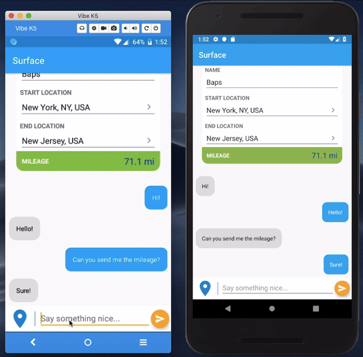
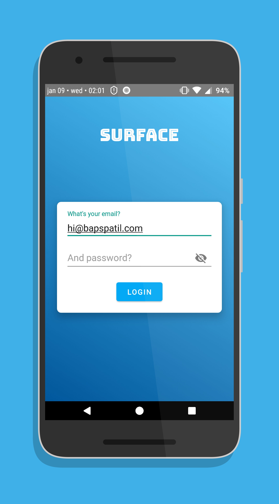
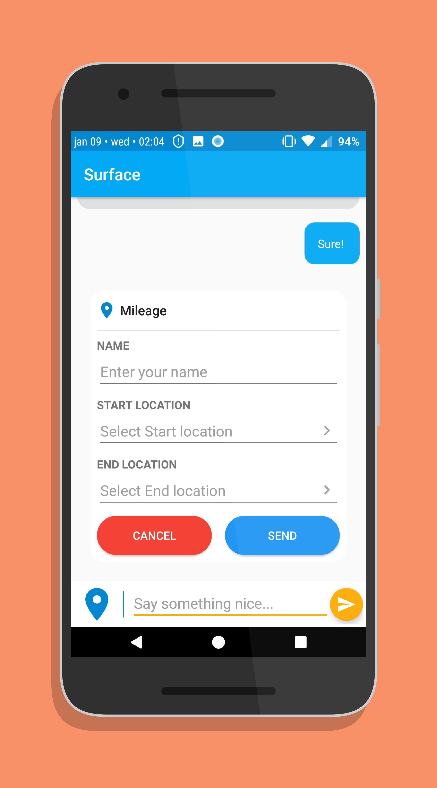
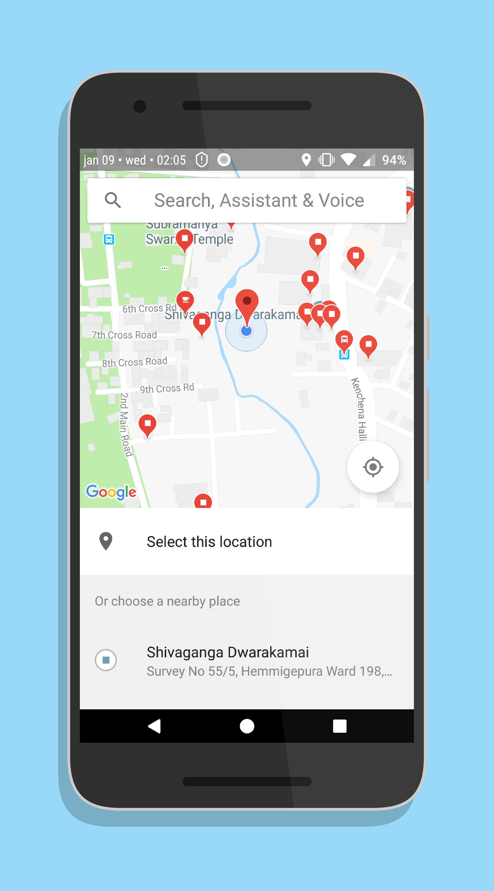
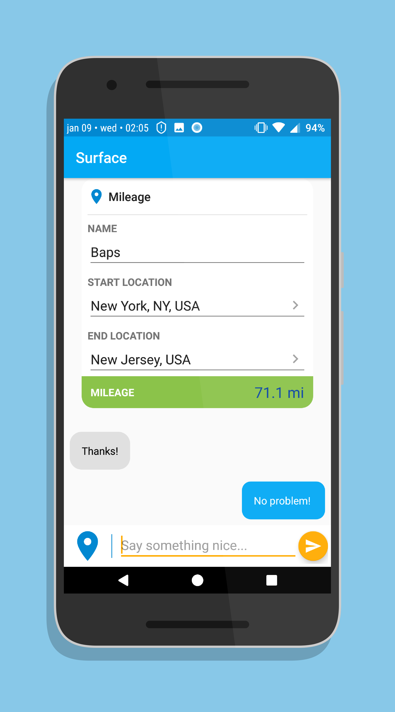

# Surface

An Android chat messaging app using Layer's XDK.

This app supports two types of messages:

1. Text messages
2. Custom Mileage messages

Layer's support for custom messages has been used to implement the Mileage messages.

**NOTE: Only 2 of the following registered users can login to the app. Their credentials are as follows.**

User 1: `hi@bapspatil.com` (Password: `surface`)<br>
User 2: `hello@hackertronix.com` (Password: `surface`)

## Prerequisites

* Layer App ID
* Google Maps API key
* Project setup on Firebase (`google-services.json`)

Place your `google-services.json` file in the `/app` folder. Once you have your **Layer App ID** & **Google Maps API key**, add the following lines to your `gradle.properties` file:

```
LayerAppId="<insert your Layer App ID here>"
GoogleMapsApiKey="<insert your Google Maps API key here>"
```

## Demo



## Screenshots

&ensp;

&ensp;

## Libraries Used

* [Android Support Library](https://developer.android.com/topic/libraries/support-library/)
* [Layer's Android XDK](https://github.com/layerhq/Android-XDK)
* [Firebase](https://firebase.google.com/)
* [Google Play Services](https://developers.google.com/android/guides/overview)
* [Retrofit](https://github.com/square/retrofit/)
* [Gson](https://github.com/google/gson/)
* [Picasso](https://github.com/square/picasso)

## Developed By

Bapusaheb Patil


https://bapspatil.com

## License

    Copyright 2018 Bapusaheb Patil

    Licensed under the Apache License, Version 2.0 (the "License");
    you may not use this file except in compliance with the License.
    You may obtain a copy of the License at

        http://www.apache.org/licenses/LICENSE-2.0

    Unless required by applicable law or agreed to in writing, software
    distributed under the License is distributed on an "AS IS" BASIS,
    WITHOUT WARRANTIES OR CONDITIONS OF ANY KIND, either express or implied.
    See the License for the specific language governing permissions and
    limitations under the License.
